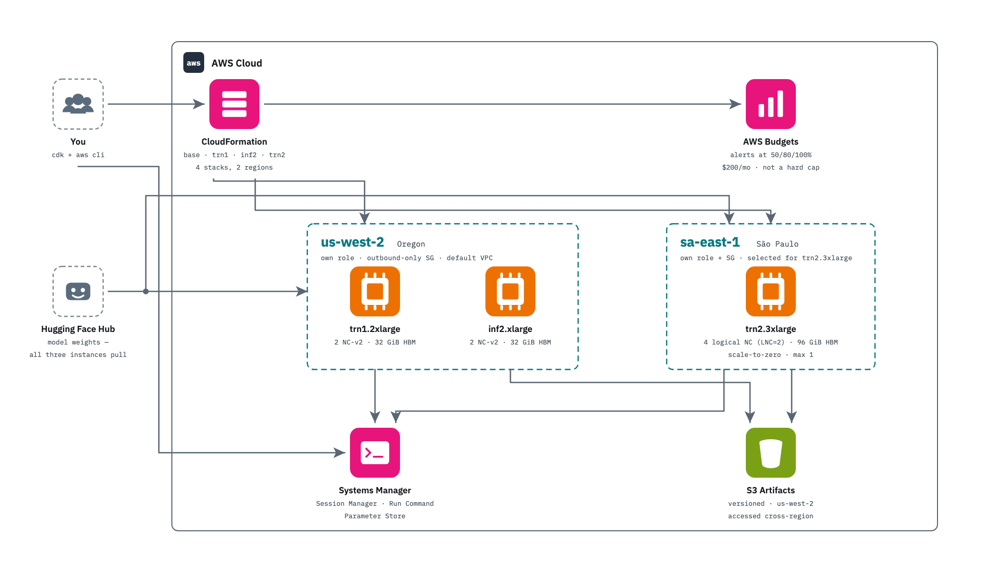

# neuron-pipelines — Trainium + Inferentia, end to end

Train a modern 8B model on AWS Trainium1, serve it on Inferentia2, measure
everything. Read [METHODOLOGY.md](METHODOLOGY.md) before quoting anything.

**The claim under test:** AWS's own AI silicon, on its smallest rentable
instances (~$1/hr each), can run a *production-shaped* LLM pipeline — LoRA
fine-tune of Llama 3.1 8B Instruct on a trn1.2xlarge, adapter merged and
shipped through S3, compiled and served by vLLM on an inf2.xlarge — with the
serving and training metrics reported the way the GPU world reports them
(TTFT/TPOT/ITL/E2EL percentiles, tokens/s, MFU, loss traces, sustained
retention), compile costs included rather than hidden.

Companion repo: [MI300X-vs-H200](https://github.com/alpharomercoma/MI300X-vs-H200)
— same harness lineage, same metrics schema, so numbers are directly
comparable across repos.



The study as built: four CDK stacks across two regions, three Neuron instances
reached only through SSM Session Manager, and a single versioned us-west-2
bucket that all three boxes read and write cross-region. The instances were
terminated on 2026-08-26 and the `NeuronPipelinesTrainium`,
`NeuronPipelinesInferentia` and `Ec2AutoshutdownStack` stacks deleted with them;
`NeuronPipelinesBase` (the bucket and the budget) and
`NeuronPipelinesTrainium2` remain. That second stack synthesises a plain
`AWS::EC2::Instance` by default and only becomes an AutoScalingGroup (min 0,
max 1) when Capacity-Block or capacity-hunt context is set — and its live
desired capacity is set outside the template, so check it rather than assume
it is zero. The diagram is therefore the architecture *as measured*, not the
account as it stands today.

## Machines

```
trn1.2xlarge  (us-west-2)                 inf2.xlarge  (us-west-2)
  1x Trainium1: 2 NeuronCores v2            1x Inferentia2: 2 NeuronCores v2
  32 GB HBM, ~820 GB/s                      32 GB HBM
  ~210 TFLOP/s dense BF16 (paper)           ~190 TFLOP/s dense BF16 (paper)
  8 vCPU, 32 GiB host RAM                   4 vCPU, 16 GiB host RAM
  Neuron DLAMI (PyTorch 2.9, Ubuntu 24.04)  Neuron vLLM 0.16 DLAMI (Ubuntu 24.04)
  torch-neuronx 2.9.0 | neuronx-cc 2.26     vllm 0.16.0 | NxDI 0.10 | neuronx-cc 2.26
  optimum-neuron 0.4.3 (pins: trl 0.24.0)   ami-035c945d557065665 (pin is load-bearing)

trn2.3xlarge  (sa-east-1)                  <- Phase 3, generational comparison
  1x Trainium2: 8 NeuronCores v3
    -> 4 logical cores at LNC=2 (default)
  96 GB HBM, 2.9 TB/s (24 GB per logical core)
  ~667 TFLOP/s dense BF16 (paper) = 3.18x trn1
  12 vCPU, 128 GiB host RAM
  Neuron DLAMI (PyTorch 2.9, Ubuntu 24.04), no AMI pin needed
```

sa-east-1 is not a preference: it is the only region offering the small
Trainium2 SKU **on demand**. (Capacity Blocks also list `trn2.3xlarge` in
ap-southeast-4; §16 correction 4 records how that was established and why
`describe-instance-type-offerings` alone said otherwise.) The artifacts bucket stays in us-west-2 and all three
boxes report into one comparison; v3 NEFFs use a separate S3 cache prefix
because a NEFF is compiled for a specific NeuronCore version.

All three boxes were provisioned by the CDK app in [cdk/](cdk/), accessed only
via SSM Session Manager (no SSH, zero ingress rules), and stopped — not
terminated — between sessions so the Neuron compile cache on EBS survived. The
one exception was the trn2, which ran inside a Capacity Block: AWS terminates
those on schedule whether you stop them or not.

## Models

| Model | Role | Regime it probes |
|---|---|---|
| Llama 3.1 8B Instruct | train (LoRA) + serve | the headline modern-model claim |
| Qwen3 8B | train (LoRA); serve *attempt* | a second architecture; serve outcome recorded either way |
| trn1 fine-tune (Llama 3.1 8B + dolly LoRA, merged) | serve | the end-to-end story |
| TinyLlama-1.1B | smoke only | $1 plumbing gate, never a headline |

## What is measured

See the lane table in [METHODOLOGY.md](METHODOLOGY.md#what-is-measured).
Short version: provenance → host CPU floor → smoke → (trn1) precompile,
LoRA SFT ×2, merge → (inf2) two-config serving sweeps, 30-min sustained,
quality, fine-tune serve, Qwen3 attempt.

## Repository layout

Everything at the top level is part of reproducing the study. Everything that
was only needed to *operate* it on one AWS account lives under `ops/`.

```
cdk/            AWS CDK app (Python): Base, Trainium, Trainium2, Inferentia stacks
shared/         the harness -- synced byte-identical to all three boxes
extras/         the extension lanes: accuracy, quantization, spec-decode, RAG, MoE
academic/       MNIST + CIFAR-10 on one NeuronCore (mlx-models parity)
analysis/       make_report.py -> comparison.json -> REPORT.md's core tables;
                phase4_summary / accuracy_summary / specdec_summary for the rest
trn1/ trn2/     per-box: PROVISIONING docs, 4-line run wrapper, raw results
inf2/
demo/           live TTFT streamer + headline tables against a warm endpoint
docs/runbook/   00..13, in execution order -- every command with expected
                output; start at docs/runbook/README.md
docs/diagrams/  architecture PNGs (README embeds architecture-clean.png)
tests/          local gate: fixtures, no AWS or Neuron hardware needed
ops/            capacity hunting, preservation, teardown, frozen one-offs --
                the account-side record. No number depends on it; the driver
                hygiene test does read it, to keep the frozen scripts frozen
```

Results are committed, not regenerated: every number in the reports traces to a
receipt under `trn1/results/`, `trn2/results/` or `inf2/results/` — json plus,
for most lanes, a log and a telemetry.csv. The triplet is *enforced* where it
gates a headline: `analysis/make_report.py:99` drops any `train/` lane other
than merge that arrives without telemetry, so an MFU number cannot be published
without the utilisation trace behind it. Elsewhere the triplet is a convention,
not a gate — the cpu, compile and merge lanes have no accelerator telemetry by
design, and the RAG receipts under `inf2/results/rag/` carry json and (mostly)
logs but no telemetry.csv at all. The three instances were terminated on
2026-08-26, so the analysis re-runs with no AWS account at all.

## Reproducing

```bash
# 0. read docs/runbook/README.md, then 00-prerequisites.md (HF license, quotas)
make test                            # local gate: harness + infra, no hardware
(cd cdk && npx -y aws-cdk@2 deploy NeuronPipelinesBase NeuronPipelinesTrainium)
# ... then follow docs/runbook/04..07 lane by lane; each box runs:
#   <box>/scripts/run_all.sh          # resumable; FORCE=1 to redo a lane
make report                          # rebuild analysis/comparison.{json,txt}
```

`make report` needs no AWS account — the results are in the tree. It rebuilds
`analysis/comparison.json` and `comparison.txt`, which are the source every
table in [REPORT.md](REPORT.md) is written from; it does not rewrite the
markdown itself. The Phase-4 and Phase-5 tables come from
`analysis/phase4_summary.py`, `accuracy_summary.py` and `specdec_summary.py`
(see [Status](#status)).

`make pull-results-all` re-mirrors results from S3 and is only useful if you
re-ran the lanes yourself — it mirrors *every* `results/` prefix on purpose,
because the three canonical ones missed 736 objects (§39).

### Forking this to your own AWS account

The infrastructure is **pinned to account 600627330911**, deliberately: both the
default-VPC lookup and the AMI lookup need a concrete environment, and the
artifacts bucket name embeds the account id because S3 bucket names are global.
Reproducing on your own account is a rename, not a redesign — but it is not a
no-op, so here is the whole list:

| what | where |
|---|---|
| account id | `cdk/app.py` (`ACCOUNT`), `cdk/tests/conftest.py` |
| bucket name | 28 files — `grep -rl neuron-pipelines-artifacts-600627330911 . --exclude-dir=.venv`. Sixteen of them are live code, not prose: the `Makefile`, `cdk/user_data/common.sh`, `shared/bin/{push_results,pull_code,sync_neuron_cache}.sh`, `shared/serve/launch_vllm.sh` and `shared/train/merge_adapter.py` among them |
| pinned AZ + subnet | `cdk/cdk.json` `context.az` / `context.subnetId`. **Deleting `cdk.context.json` does not clear these** — they are committed defaults, and both the Trainium and Inferentia stacks consume them |
| budget alert email | `cdk/cdk.json` `context.alertEmail` — the author's address, or the budget notifies the wrong person |
| cached lookups | **delete `cdk/cdk.context.json` first.** It caches this account's VPC, subnet and AMI ids; left in place, `cdk synth` reuses them and silently targets the wrong network |
| a default VPC | `base_stack.py` does `Vpc.from_lookup(is_default=True)`. An account without one cannot deploy this app unchanged |
| HF token | SSM SecureString `/neuron-pipelines/hf-token`, per region (runbook 00) |

Everything else — the harness, the lanes, the analysis — is account-agnostic.

## Caveats worth knowing before you read the numbers

- Compile time is real and reported (rule 3) — the cold path costs tens of
  minutes per server config; the warm path is the production path.
- The serving concurrency grid tops out where KV memory says it must
  (rule 6); every sweep declares its grid in `grid.json`.
- Board power is not exposed on these instances: no energy numbers, by rule 7.
- One seed, one box per role, demonstration-scale SFT (known limits section).
- Trainium1/Inferentia2 are the previous Neuron generation — deliberately:
  that is what a newcomer can actually rent at these prices.

## Status

Complete through Phase 5. Measured results in [REPORT.md](REPORT.md) +
[REPORT-EXTENSIONS.md](REPORT-EXTENSIONS.md); every number regenerates from
`analysis/comparison.json` via `make report`, the Phase-4 tables from
`analysis/phase4_summary.py`, and the Phase-5 tables from
`analysis/accuracy_summary.py` and `analysis/specdec_summary.py`.

**Phase 5 — correctness, acceptance, and replication** (§35-38):

| question | answer |
|---|---|
| Do the graphs compute the *right* answer, not just fast? | yes — zero-shot ImageNet is **bit-exact vs CPU on 10,000 images**, both boxes; ASR WER moves −0.02 to −0.03 pp. All six paired lanes PASS the MLPerf gate (§35) |
| Can a fast graph be silently wrong? | **yes** — the traced CLIP text tower returned NaN for all 1000 classes at 1,165 images/s with `Compiler status PASS` (§35.3) |
| How far does speculative decoding actually go? | **2.45× at k=7** over Spec-Bench's 39 prompts; cost is linear (R² 0.999993), acceptance is what decays (§36) |
| Does the 68.3% MFU headline replicate on another corpus? | yes — Tulu-3 lands at **2,964 tok/s vs dolly's 2,952**, 0.4% apart (§37) |
| Why is gpt-oss-20b blocked on inf2? | a MoE kernel **shape** constraint (`hidden_size` 2880 not divisible by 128), not memory — no OOM evidence at all (§36.3) |

One Phase-5 lane is deliberately **not** published as a result: the midtrain
learning-rate-schedule comparison failed its own control (bit-identical loss
traces across two schedules that demonstrably ran). The anomaly is recorded in
§38 instead of a recommendation.

**The boxes are gone.** All seven EC2 instances backing this study were
terminated on 2026-08-26. Six of the seven disks survive as EBS snapshots; the
**trn2 was never snapshotted** — it expired with its Capacity Block, and its
results existed only in S3 until they were archived to Glacier Deep Archive and
committed here (§39). Everything needed to rebuild the rest — snapshot IDs, AMI
pins, user-data, KMS keys, CloudFormation templates — is in
[ops/preservation/2026-08-26-RECOVERY.md](ops/preservation/2026-08-26-RECOVERY.md).
Results in this repo regenerate without any AWS access.

**Phase 4 — the training stages either side of SFT** (§32):

| stage | on one Trainium1 |
|---|---|
| SFT | works — 2,952 tok/s, 68.3% MFU @ seq 2048 |
| ORPO (preference) | works — 1,181 tok/s, 30.2% MFU @ max_length 1024 |
| DPO | unresolved — the reference forward **compiles**; the lane dies later, in a host transfer |
| GRPO / RLVR | architecturally blocked — no `generate()` on the training model class |
| pretraining from scratch | works — 4,573 tok/s on one core; the whole chip is worth **+7.7%**, measured |

Read §32.3 and §32.4 before quoting the ORPO figures: they are throughput
measurements at shorter sequences than the SFT lane, and their loss did not
descend.

**Pretraining, and what the whole chip is actually worth.** SmolLM2-360M has 15
attention heads and 5 KV heads; neither divides 2, so that architecture is
stranded on one of the chip's two NeuronCores (optimum-neuron 0.4.3 offers no
data-parallel dimension, so tensor parallelism is the only way to use both).
Running a 16-head/4-KV variant at hidden 1024 — 386M params, and *not*
SmolLM2-360M — at both widths from the same random init gives the controlled
answer: **2,463.5 tok/s at TP=1 against 2,652.6 at TP=2, a 7.7% gain for
doubling the cores.** Tensor parallelism adds a collective on every layer, and
at this model size the collectives eat almost all of it. Low MFU here is the
model's size, not the chip's speed — the same chip reaches 68.3% on an 8B
fine-tune.

**A correction that supersedes earlier text.** This table previously recorded
DPO as *terminal, the adapter-disabled reference forward fails to compile*.
That is wrong. Moving the reference pass out of the training step and running
it once beforehand produces `Compiler status PASS` on that forward: what
blocked DPO was its **placement inside the training-step graph**, not the
forward itself. The lane still yields no throughput number — it dies afterwards
in a host transfer (`.cpu()` on an unflushed lazy tensor, `BufferMapAdd`) — so
the outcome is unchanged while the stated reason is retracted.
